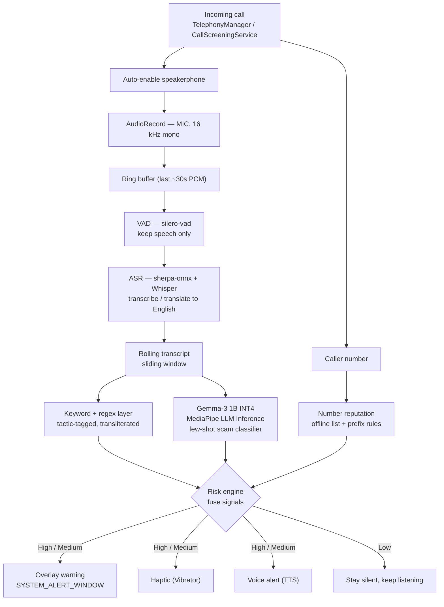

# CallGuard — On-Device Scam-Call Shield
### Build spec & implementation plan (iQOO Hackathon, ~2 days)

> *Working title — rename freely (Kavach, SwarRakshak, etc.).*

---

## 1. The problem, in simple words

India runs on phone calls and UPI. Scammers exploit both. They call pretending to be your bank, the police, the telecom operator, or a delivery service, create panic — *"your KYC has expired," "your SIM will be blocked," "this is a digital arrest," "there's a suspicious transaction"* — and in that panic they get the victim to do one of two fatal things: **read out an OTP/PIN**, or **install a remote-access app like AnyDesk or TeamViewer**. Within minutes the bank account is drained.

The protection people have today is **number-based** (e.g. Truecaller): it tells you *who* might be calling, not *what they are saying*. The moment you pick up, you're on your own — and the scam lives entirely in the *content* of the conversation.

The obvious fix — "analyse the call and warn the user" — runs straight into a wall: **you cannot send someone's live call audio to a server.** It's private, and on Android the telephony audio stream is locked behind system-only permissions. So the analysis has to happen **on the phone itself.**

**CallGuard** is a real-time, fully on-device shield that listens to your live call, recognises scam tactics as they unfold, and warns you — with an on-screen alert, a buzz, and a spoken warning — *before* you share an OTP or install a malicious app. It works in your language, and it works in airplane mode. Your conversation never leaves your phone.

---

## 2. Tech stack

Everything below runs **on the handset**. sherpa-onnx is the backbone because it runs on-device ASR (streaming + Whisper), does multilingual + translation, includes VAD and speaker diarization, and — importantly — is cross-platform (Android **and** iOS), so the "brain" is written once.

| Layer | Choice | Why |
|---|---|---|
| **App / platform** | Native **Android (Kotlin)**, minSDK 26+ | All ML libs have first-class Kotlin support; Android is ~95%+ of India's market and the iQOO target |
| **Call detection** | `TelephonyManager` / `CallScreeningService` | Know a call is live + get the caller number, offline |
| **Audio capture** | `AudioRecord`, source `MIC`, 16 kHz mono, on **speakerphone** | Telephony downlink is system-locked; speakerphone lets the mic re-capture the caller's voice acoustically (use raw `MIC`, not `VOICE_COMMUNICATION`, so echo-cancellation doesn't remove the far end) |
| **Voice activity** | **silero-vad** (via sherpa-onnx) | Only run ASR on actual speech → saves battery/heat |
| **ASR (speech→text)** | **sherpa-onnx** running **Whisper** (multilingual) or streaming **Zipformer** (fast English) | On-device, streaming or chunked, transcribe *or* translate-to-English in one step |
| **Translation** | Whisper `translate` mode (primary) or **Google ML Kit** on-device translate (fallback) | Turns regional speech into English so the classifier never needs to "know" the language |
| **Scam intent** | **Hybrid**: keyword/regex (tactic-tagged, transliterated) **+ Gemma-3 1B (INT4)** via **MediaPipe LLM Inference API** | Keywords = instant, high-precision, always-demoable; SLM = the fuzzy "is this manipulative?" judgment |
| **Number reputation** | Caller ID + bundled **offline** scam-number/prefix list | Metadata check — doesn't touch the audio-privacy promise; works offline |
| **Alerts** | `SYSTEM_ALERT_WINDOW` overlay + `Vibrator` haptic + Android **TTS** | Reaches the user even inside the call screen; works for low-literacy/elderly users |
| **Storage / sync** | On-device only; optional opportunistic blocklist sync | Audio stays local; only number-list metadata may sync |
| **iOS (roadmap)** | Same sherpa-onnx core + CallKit Call Directory (number) / in-app VoIP audio | Shared brain; native-call audio isn't accessible on iOS (platform wall) |

---

## 3. Architecture

The whole pipeline lives inside a single on-device boundary — nothing leaves the phone, and it runs in airplane mode. The audio path and the number path are two inputs that meet at a shared **risk engine**, which decides whether to alert.

**Two design choices worth defending to judges:**
1. **Hybrid detection.** The keyword layer fires in milliseconds and guarantees the demo always reacts; the SLM adds explainable "AI judgment" (returns risk + tactic + reason). If the SLM is slow or unsure, the system degrades gracefully to keywords.
2. **Shared core, platform-specific capture.** The ASR + risk engine are portable (sherpa-onnx). Only the audio-capture layer is OS-specific — full live capture on Android, number/in-app on iOS. This is your scalability story.

---

## 4. Implementation plan (most important first)

Priority tags: **P0** = the spine, must work; **P1** = the differentiators; **P2** = brownie points, only if P0+P1 are solid. Protect P0 above everything — if you build nothing else, a working P0 in English is a complete, honest demo.

### Phase 0 — Setup & de-risk *(first 2–3 hrs, do before anything else)* — **P0**
- Prove the scariest unknown first: capture raw PCM from the mic **during a speakerphone call**, dump the waveform, confirm it contains the caller's voice (play a recording aloud to test).
- In parallel: get the MediaPipe sample running Gemma-3 1B, and sherpa-onnx transcribing the mic.
- *If capture works and both models load, the project is safe.* Discovering the capture problem on Day 2 is fatal — kill this risk now.

### Phase 1 — Core spine *(the demo)* — **P0**
1. **Call detection + auto-speakerphone + mic capture** → clean 16 kHz PCM into a ring buffer holding the last ~30s.
2. **VAD + ASR** (start with fast English — streaming Zipformer or Whisper) → live rolling transcript on screen.
3. **Keyword/regex scam layer** — tactic-tagged, high-precision markers (OTP, PIN, CVV, AnyDesk, TeamViewer, QuickSupport, KYC expired, SIM block, digital arrest, CBI/police/customs, refund, lottery) → instant risk flag.
4. **Alert layer** — overlay banner ("⚠ Likely scam — don't share OTP / don't install apps") + haptic + spoken TTS warning.
- ✅ **Milestone: end-to-end English scam flag, fully offline.** This alone is demoable.

### Phase 2 — The "AI" depth + India relevance — **P1**
5. **Gemma-3 1B classifier.** Feed the last ~30s of transcript, prompt for tiny JSON `{"risk":"high","tactic":"remote-access + OTP","reason":"..."}` with 3–4 few-shot Indian-scam examples. **Throttle to run every ~3–4s** on the sliding window (not per token) to stay real-time. Fuse keyword hits + SLM output in the **risk engine** → single low/med/high level with a named tactic.
6. **Local languages.** Switch ASR to Whisper multilingual and use **translate mode** (regional speech → English) so the classifier is unchanged. Add a **transliterated keyword list** (Hinglish + regional spellings) and 2–3 Hindi few-shot examples. Demo one Hinglish and one regional-language call. *Trade-off: Whisper is chunk-based, so alerts land in a few seconds rather than instantly — fine for this use case.*
7. **Number reputation.** Use the caller ID + a bundled **offline** heuristic (not-in-contacts + international/spoofed prefix + first-time caller → risk multiplier; "claims to be a bank but not on the 1600 verified series" → flag). Feed into the risk engine.

### Phase 3 — Brownie points *(only if P0 + P1 are solid)* — **P2**
8. **Offline scam-number DB with opportunistic sync.** Ship a static blocklist; sync when online. *Metadata only — audio never leaves the device; this actually strengthens the privacy pitch.* Effort: low.
9. **Speaker turn separation.** Use sherpa-onnx VAD-based turn segmentation (or its built-in diarization as a stretch) to attribute lines and cut false positives from the user reading things aloud. Effort: medium.
10. **Post-call summary.** After hang-up, show "This call used these tactics: …" + one-tap "Report number." Great closing beat for the demo. Effort: low.
11. **Auto language detection.** Whisper spoken-language-ID picks the model/prompt automatically so the user does nothing. Effort: low–medium.
12. **Thermal/battery awareness.** GPU/NPU delegate for the SLM; throttle or downshift models under heat. Shows production thinking. Effort: medium.
13. **Accessibility mode.** Large-text, high-contrast, loud spoken warnings for elderly/low-literacy users — *the actual victims.* Cheap and emotionally resonant. Effort: low.
14. **iOS parity slide (not built).** Reuse the sherpa-onnx core; iOS gets Call Directory number-labeling + in-app-call analysis (native-call audio is impossible on iOS). Present as roadmap, don't attempt to build. Effort: 0 (it's a slide).

---

## 5. Suggested 2-day timeline

**Day 1** — Phase 0 spike (morning) → Phase 1 items 1–4 (rest of day). *End Day 1 with a working English demo.*
**Day 2 morning** — Phase 2 items 5–7 (SLM + Hindi/one regional language + number reputation).
**Day 2 afternoon** — pick 2–3 quick P2 wins (10, 13, 8), record demo scripts, rehearse, build the pitch, keep a bug buffer.

**Fallback ladder (sacrifice from the bottom up):** iOS/diarization → regional languages → number DB → SLM → *(never)* the P0 spine.

---

## 6. Demo & pitch

**The demo:** Airplane mode visibly ON. Play a recorded scam call from a second device's speaker. CallGuard, hearing it through the mic, streams the transcript and fires the banner + haptic + voice warning the instant the "scammer" says *"install AnyDesk"* or *"tell me the OTP."* Then hold up the phone: no network, everything ran here.

**The pitch, in order:**
1. India-specific stakes: UPI/vishing losses are enormous, and the scam lives in the *content* of the call.
2. Why on-device is the **only legal way** — you cannot stream someone's call to a server.
3. The architecture: speakerphone capture → on-device ASR → hybrid detection → instant warning.
4. *"We detect the tactic, not the language"* — urgency, false authority, remote-access, secrecy, payment redirection are universal; regional languages are a scaling axis, not a gap.
5. Roadmap: full 22-language coverage via AI4Bharat IndicConformer (ONNX → sherpa-onnx); iOS via the shared core.

---

## 7. Honest constraints (own them before a judge points them out)
- **Speakerphone required** on Android (telephony downlink is system-locked). Reframe as speaker-mode protection — scammers already push victims onto speaker to install apps.
- **No live protection on native iOS calls** — hard platform wall, not effort. Android-first is the correct India strategy anyway.
- **Regional ASR accuracy** is imperfect for low-resource languages; the transliterated keyword layer is the safety net that catches the critical tokens regardless.

---

## 8. Explicitly NOT building (scope discipline)
Fine-tuned custom classifier · auto-hangup/blocking · full 22-language on-device ASR · true neural diarization · a live crowd-sourced backend · iOS live-call audio · production battery-killer survival. Each is a conscious cut, and each has an honest one-line answer if asked.
